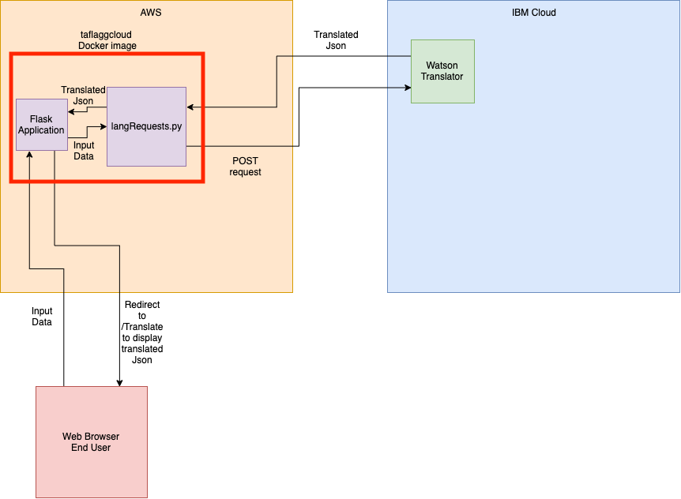

# Language Translator 
For quick translation and word counting you can take advantage of my front end hook into Watson's Translator API. Using this applicaiton you can translate a variety of languages to and from English. You can access the front end from the following link 3.16.48.2:5000

## Technologies used
 - IBM CLOUD: IBM Cloud is used to contact a Watson API to perform translations.
 - Docker: Docker was used to containerize a Flask application which would handle all of the api calls to and from IBM Cloud
 - Dockerhub: Dockerhub was used to host my docker image, it's repository is [here](https://hub.docker.com/repository/docker/taflagg/cloudproject)
 - AWS: My docker image was deployed to AWS to be run which is accessed from the link in the initial description. Note this will be taken down by the end of 2019. 
 
 
 ## Architecture Diagram
 
 You can find a detialed description of the architecture diagaram as well as how to run it in the main repository which will be made public at the end of 2019 [here](https://github.com/tf3193/marist-mscs621-2019-TroyFlagg)

